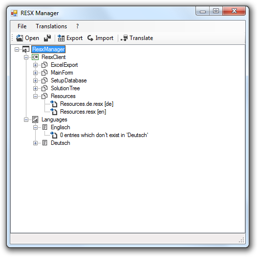

# ResxManager
Consolidates, synchronizes and translates .NET resources (.resx, .wxl). Supports export to Excel (.xlsx) and automating translation.

## Features
* Translates any Visual Studio resource files (.resx) and Windows Installer XML toolkit localization files (.wxl)
* [Export and Import to Microsoft Excel (.xlsx)](docs/ExportImportResourcesToExcel.md) without having Excel installed
* Analysis of missing translations
* [Automatic translation](docs/AutomaticTranslation.md) using a custom translation database
* [Integration with Team Foundation Server (TFS)](docs/HowToUseWithTeamFoundationServer.md) **NEW**
* [Exclude Projects, Directories, Files or Entries from Translation](docs/ExcludeProjectsDirectoriesFilesEntries.md) by customizable patterns **NEW**
* No installation of Visual Studio required, so usable by non-devolopers as well as developers
* Portable application with simple user interface does not require an Installation

## Requirements
* Microsoft .NET Framework 4
* SQL Server 2012 (for translation storage only)

## Documentation
* [How to get started](docs/Documentation.md) 
